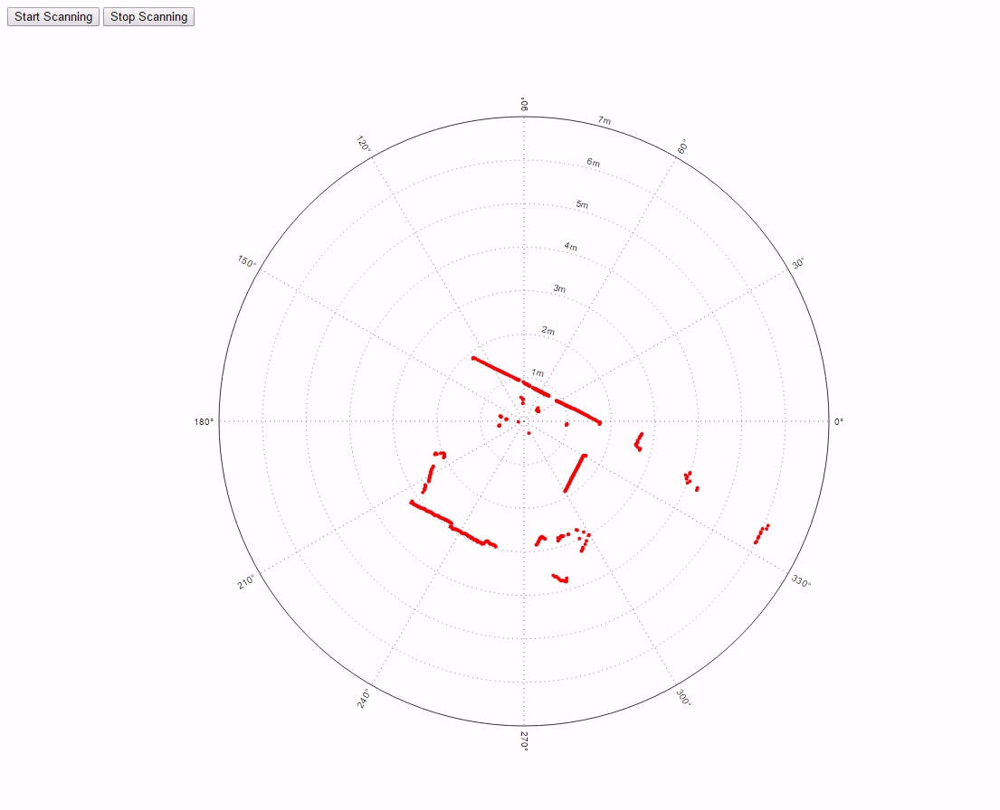

# Node.js RPLidar

## Prerequisites

Node >= 4.0.0
Tested on Windows 10 x64

## Installation

```bash
npm install rplidar
```

## Usage

```js
const RPLidar = require('rplidar');

const lidar = new RPLidar();

lidar.on('data', console.log);

lidar.init().then(() => {
    return lidar.getHealth();
}).then(health => {
    console.log('health: ', health);

    return lidar.getInfo();
}).then(info => {
    console.log('info: ', info);

    return lidar.scan();
}).then(() => {
    console.log('started scanning');
});
```

With ES2017:

```js
const RPLidar = require('rplidar');

const lidar = new RPLidar();

lidar.on('data', console.log);

lidar.init().then(async () => {
    let health = await lidar.getHealth();
    console.log('health: ', health);
    
    let info = await lidar.getInfo();
    console.log('info: ', info);
    
    await lidar.scan();
    console.log('started scanning');
});
```


